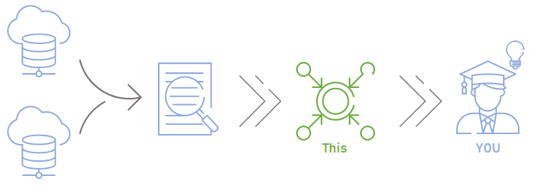

# Publicly Available Datasets For Electric Load Forecasting
A (hopefully eventually) complete listing of the most popular electric LF datasets

### Why?
We found it difficult to find suitable datasets in the flood of information. 
So we came up with the idea of doing a proper search and making the results available to the public.


### What?
Based on a sample set of representative publications, relevant, publicly accessible data sets were extracted, structured and analyzed. 
The details of the search can be found in the scientific publication: [https://doi.org/10.15488/17659](https://doi.org/10.15488/17659)


### Improvements? 🤝
We are happy about any kind of cooperation, feedback or extension to make the list even more valuable for other scientists. 
So feel free to expand the list and initiate a pull request.

# The list
| ID  | Abbrev	| Name	                                        | Domain<sup>1</sup> | Resolution<sup>2</sup> | Features<sup>3</sup> | Duration<sup>4</sup> | Spanned years                | Horizons<sup>5</sup>  | Regions<sup>6</sup> | Type<sup>7</sup>|Links|Access<sup>8</sup>|
| -- 	|--       |----------------------------------------------	|------	             | -----------            | -----------          | -----                | --------------------------------------  | -----------------------            | ------------- |----|--------|--------|
|1	| ISO-NE	  |	New England Independent System Operator       |S      |60         	|E		|108    |2003-2014     |❌✔️✔️❌     |✔️|📦|[🔗Link](https://www.iso-ne.com/isoexpress/web/reports/pricing/-/tree/zone-info)|🔓|
|2	|NYISO		  | New York Independent System Operator	        |S	|5		|E		|264	|2001-2023	|✔️✔️✔️❌|✔️|📦|[🔗Link](http://mis.nyiso.com/public/P-58Blist.htm)|🔓|
|3	|PJM		    | PJM Hourly Energy Consumption                 |S	|60		|E		|240	|1998-2018	|❌✔️✔️✔️|✔️|📦|[🔗Link](https://www.kaggle.com/datasets/robikscube/hourly-energy-consumption?resource=download)|🔓|
|4	|CIF		    | CIF 2016 competition dataset          	      |?	|d,m,y		|Undef.		|8-909	|unknown	|❌❌✔️✔️|❌|📦|[🔗Link](https://irafm.osu.cz/cif2015/main.php?c=Static&page=download)|🔓|
|5	|GEFCOM14   | GEFCom 2014                                  	|S	|60		|E, W, T, PV	|10	|2021		|❌✔️❌❌|❌|📦|[🔗Link](https://www.dropbox.com/s/pqenrr2mcvl0hk9/GEFCom2014.zip?dl=0&file_subpath=%2FGEFCom2014+Data)|🔓|
|6	|EUNITE	    | EUNITE 2001                          	        |S	|30		|E, T, H	|24	|1997-1999	|❌✔️✔️❌|❌|📦|[🔗Link](https://www.csie.ntu.edu.tw/~cjlin/libsvmtools/datasets/regression.html)|🔓|
|7	|ENTSO-E	  | ENTSO-E electric load dataset	                |S	|60		|E		|<=288	|till 2015	|❌✔️✔️✔️|✔️|📦|[🔗Link](https://www.entsoe.eu/publications/statistics-and-data/)|🔓|
|29<sup>9</sup>	| EWELD 	    | Large-Scale Industrial and Commercial Load Dataset in Extreme Weather Events |I	|15		|E, W, xW	|<=74	|2016-2022	|✔️✔️✔️✔️|✔️ (386)|📦|[🔗Link](https://www.nature.com/articles/s41597-023-02503-6)|🔓|
|28<sup>9</sup>	| WPuQ		    | Electrical single-family house and heat pump load |R	|<1		|E	|30	|2018-2020	|❌✔️✔️❌|✔️ (38)|📦|[🔗Link](https://www.nature.com/articles/s41597-022-01156-1)|🔓|
|32<sup>9</sup>	| PanETESA | Panama ETESA	|S |60		|E, W, H		|66|2015-2020	|❌✔️✔️✔️|❌|📦|[🔗Link](https://www.kaggle.com/datasets/ernestojaguilar/shortterm-electricity-load-forecasting-panama)|🔓|
|38<sup>9</sup>	|REFIT	  | REFIT: Electrical Load Measurements	|H	|8sec		|E		|20	|2013-2015|✔️✔️✔️❌|✔️(20)|📦|[🔗Link1](https://doi.org/10.15129/31da3ece-f902-4e95-a093-e0a9536983c4) [🔗Link2](https://doi.org/10.5281/zenodo.5063428)|🔓|
|39<sup>9</sup>	|ECD-UY	  | household electricity consumption dataset of Uruguay |S, R	|1-15	|E		|11-23|2019-2020|✔️✔️❌❌|✔️(9)|📦|[🔗Link1](https://www.nature.com/articles/s41597-022-01122-x) [🔗Link2](https://doi.org/10.6084/m9.figshare.c.5428608.v1)|🔓|
|40<sup>9</sup>	|IDEAL	  | IDEAL UK Household Energy Dataset 255 |R	|1-12sec	|E, W, T |23|2019-2020|✔️✔️✔️❌|✔️(255)|📦|[🔗Link1](https://www.nature.com/articles/s41597-021-00921-y) [🔗Link2](https://doi.org/10.7488/ds/2836)|🔓|
|41<sup>9</sup>	|HANOI-Res | Residential Apartments Dataset Hanoi, Vietnam (CAMaRSEC Project) |R	|15	|E, W, T |12|2020-2021|✔️✔️❌❌|✔️(49)|📦|[🔗Link1](https://data.mendeley.com/datasets/s9wkdww94w/2) [🔗Link2](https://doi.org/10.17632/s9wkdww94w.2)|🔓|
|8	|LCL		    | LCL Load Dataset (London Households)          |H	|30		|E		|12	|2013		|❌✔️❌❌|❌|📁|[🔗Link](https://data.london.gov.uk/dataset/smartmeter-energy-use-data-in-london-households)|🔓|
|9	|SET		    | Energy Consumption Dataset for Milano/Trento 	|S	|10		|E		|<1	|2013		|✔️❌❌❌	|❌|📁|[🔗Link](https://www.nature.com/articles/sdata201555)|🔓|
|10	|BDG-Proj	  | Building Data Genome Project	                |S	|60		|E		|12	|unknown	|❌✔️❌❌	|✔️|📁|[🔗Link](https://github.com/buds-lab/the-building-data-genome-project)|🔓|
|34<sup>9</sup>		|BDG-Proj2  | Building Data Genome Project 2 (BDG2)         |R |60		|E		|24	|2016-2017	|❌✔️✔️❌	|✔️ (1636)|📁|[🔗Link](https://github.com/buds-lab/building-data-genome-project-2)|🔓|
|11	|IHPC		    | Individual Household power consumption |S	|1		|E		|48	|2006-2010	|✔️✔️✔️✔️	|❌|📁|[🔗Link](https://archive.ics.uci.edu/dataset/235/individual+household+electric+power+consumption)|🔓|
|12	|GEFCOM12	| GEFCom 2012	|S	|60		|E, W, T	|42	|2004-2008	|❌✔️✔️❌	|❌|📁|[🔗Link](https://www.kaggle.com/c/global-energy-forecasting-competition-2012-load-forecasting/)|🔓|
|13	|OPSD-TS		    | Open Power System Data TS	|S	|15-60		|E, PV, W	|148	|2005-2019	|✔️✔️✔️✔️	|✔️|📁|[🔗Link](https://doi.org/10.25832/time_series/2019-06-05)|🔓|
|27<sup>9</sup>	| OPSD-HH		    | Open Power System Data Household Data |R, I	|1-60		|E, PV	|diff	|2012-2019	|✔️✔️✔️✔️	|✔️|📁|[🔗Link](https://data.open-power-system-data.org/household_data/)|🔓|
|14	|ELD		    | ElectricityLoadDiagrams20112014	|S	|15		|E		|36	|2011-2014	|✔️✔️✔️✔️	|❌|📁|[🔗Link1](https://archive.ics.uci.edu/dataset/321/electricityloaddiagrams20112014) [🔗Link2](https://doi.org/10.24432/C58C86)|🔓|
|15	|ENERTALK	  | ENERTALK Dataset Korea (household)	|S	|15 hz		|E		|12	|2016		|✔️✔️❌❌	|❌|📁|[🔗Link](https://www.nature.com/articles/s41597-019-0212-5)|🔓|
|16	|S-TSO	    | Spanish Transmission Service operator (TSO)		|H	|60		|>25		|24	|2017-2018	|❌✔️✔️❌	|❌|📁|[🔗Link](https://www.kaggle.com/datasets/nicholasjhana/energy-consumption-generation-prices-and-weather)|🔓|
|26<sup>9</sup> | CER        | CER Smart Metering Project |R,I |30 |E |18 |2009-2010|❌✔️✔️❌|✔️(5237)|📁|[🔗Link](https://www.ucd.ie/issda/data/commissionforenergyregulationcer/)|📧|
|30<sup>9</sup>	|DEDDIAG | domestic electricity demand dataset (individual appliances in Germany)	|R |1Hz		|E		|2-44	|2011-2014	|✔️✔️✔️❌	|✔️(14)|📁|[🔗Link1]( https://www.nature.com/articles/s41597-021-00963-2) [🔗Link2](https://figshare.com/articles/dataset/DEDDIAG_a_domestic_electricity_demand_dataset_of_individual_appliances_in_Germany/13615073)|🔓|
|31<sup>9</sup>	| AusSmartGrid | Electricity Use Interval Reading	|R |60		|E		|?|2010-2014	|❌✔️✔️❌	|✔️|📁|[🔗Link](https://data.gov.au/data/dataset/smart-grid-smart-city-customer-trial-data/resource/b71eb954-196a-4901-82fd-69b17f88521e)|🔓|
|35<sup>9</sup>	| UK-GRID | Electricity consumption UK 2009-2024	|S | 30		|E |180|2009-2024	|❌✔️✔️✔️	|❌|📁|[🔗Link](https://www.kaggle.com/datasets/albertovidalrod/electricity-consumption-uk-20092022)|🔓|
|36<sup>9</sup>	| HoustonRes | Houston Residential power usage (one house)|R |60		|E, W		|49|2016-2020	|❌✔️✔️❌	|❌|📁|[🔗Link](https://www.kaggle.com/datasets/srinuti/residential-power-usage-3years-data-timeseries)|🔓|
|37<sup>9</sup>	| CU-BEMS-Bangkok |Bangkok CU-BEMS, smart building energy and IAQ data |R |1		|E, W		|18|2018-2019	|✔️✔️✔️❌	|❌|📁|[🔗Link](https://www.kaggle.com/datasets/claytonmiller/cubems-smart-building-energy-and-iaq-data)|🔓|
|17	|RTE-France	| RTE France |S	|30		|E		|12	|2012-2020	|❌✔️❌❌	|✔️|🌐|[🔗Link](https://www.rte-france.com/en/eco2mix/download-indicators)|🔓|
|18	|AEMO		    | Australian Energy market operator 	|H	|60		|E		|12	|2013		|❌✔️❌❌|✔️|🌐|[🔗Link](https://aemo.com.au/energy-systems/electricity/national-electricity-market-nem/data-nem/network-data)|🔓|
|19	|IESO-O	    |	IESO Ontario |H	|60		|E, P		|20+	|2022-2023	|❌✔️✔️❌	|❌|🌐|[🔗Link](https://www.ieso.ca/en/Power-Data/Data-Directory)|🔓|
|20	|AESO		    | Alberta Electric Sys. Op. Electrical Load Dataset  	|S	|60		|E		|132	|2005-2016	|❌✔️✔️✔️|❌|🌐|[🔗Link](https://www.aeso.ca/market/market-and-system-reporting/data-requests/)|🔓|
|21	|PPS		    | Polish power system	|S	|15-60		|E		|120+	|2013- now	|✔️✔️✔️✔️	|❌|🌐|[🔗Link](https://www.pse.pl/web/pse-eng/data/polish-power-system-operation/load-of-polish-power-system)|🔓|
|22	|AUSGRID	  | Ausgrid: Distribution zone substation 	|S	|15		|E		|204	|2005-2022	|✔️✔️✔️✔️|✔️(>100)|🌐|[🔗Link](https://www.ausgrid.com.au/Industry/Our-Research/Data-to-share/Distribution-zone-substation-data)|🔓|
|23	|KPX		    | KPX  Korea	|H	|5		|E		|240	|2003-now	|✔️✔️✔️✔️|❌|🌐|[🔗Link](https://epsis.kpx.or.kr/epsisnew/selectEkgeEpsMepRealChart.do?menuId=030300)|🔓|
|24	|ADMIE		  | Independent Electricity Transmission Operator 	|S	|60		|E		|120+	|2011-now	|❌✔️✔️✔️|✔️|🌐|[🔗Link](https://www.admie.gr/en/market/market-statistics/detail-data)|🔓|
|25	|Pecan		  | Pecan Street dataset	|S	|15		|E, W		|24	|2017-2018	|✔️✔️✔️❌|✔️|🌐|[🔗Link](https://dataport.pecanstreet.org/)|🔓|
|33<sup>9</sup>	| Cal-ISO | California ISO Hourly Load Data 	|S |60		|E		|100+|2014-now	|❌✔️✔️✔️	|✔️|🌐|[🔗Link1](https://www.caiso.com/generation-transmission/resource-adequacy#Historical) [🔗Link2](https://bigdata.seas.gwu.edu/data-set-15-california-iso-load-data-set/)|🔓|


#### Legend

<sup>1</sup>Domain: Either system level load (S), residential load (R) or Industry (I)

<sup>2</sup>Resolution: In minutes, if not other stated (d=day, m=month, y=year, hz=1sec)

<sup>3</sup>Features: Electricity (E), Weather (W),  Extreme Weather Events, e.g. heat periods and taifune (xW), Temperature (T), Photovoltaic production (PV), Holiday features (H), Price (P)

<sup>4</sup>Duration: in number of months

<sup>5</sup>Forecasting-Horizons for modeling applicable: Very Short Term (VST), Short Term (ST), Medium Long Term (MT), Long Term (LT)

<sup>6</sup>Dataset records multiple regions / consumers separately (e.g. buildings, cities, countries) or disaggregated single loads available. Numbers in brackets indicate the number of regions / consumers / loads

<sup>7</sup>Type: Either 📦 = a collection (accumulation of datasets), 📁=a file or achive or 🌐=a data platform / API

<sup>8</sup>Access: Either 🔓 = can be accessed directly (no login, no request), 📧 = written application / request has to be sent first

<sup>9</sup> not part of the original Paper, added later (only here)

*for further details take a look at the publication below ⤵️*


# How to cite
If this work has helped you with your scientific work, we would appreciate a proper mention. ❤️

Our citation recommendation is:
```
Baur, L.; Chandramouli, V.; Sauer, A.: Publicly Available Datasets For Electric Load Forecasting – An Overview. In: Herberger, D.; Hübner, M. (Eds.): Proceedings of the CPSL 2024. Hannover : publish-Ing., 2024, S. 1-12. DOI: https://doi.org/10.15488/17659
```

# Acknowledgements

💰 We'd like to thank the German Federal Ministry of Economic Affairs and Climate Action (**BMWK**) and the project supervision of the Project Management Jülich (**PtJ**) for the project „FlexGUIde“ which allowed for the work. 

💡 We would also like to thank an **anonymous reviewer** who suggested publishing the datasets not only in the above-mentioned publication but also as a repository.
